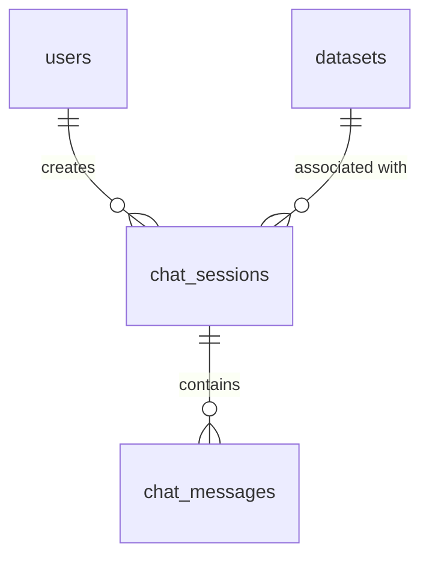

# Implementation Plan - Module 17: AI Insight Enhancement & Natural Language Layer

This document outlines the design and step-by-step implementation plan for adding conversational analytics and natural-language interpretations to InsightFlow AI.

## User Review Required

> [!IMPORTANT]
> - **Provider-Agnostic LLM Bridge**: To support multiple LLM providers (e.g., Google Gemini, OpenAI) without complex library compilation issues on Windows with Python 3.14, we will build a lightweight HTTP-based LLM bridge using `httpx`. It will read configurations from `.env` (like `AI_PROVIDER`, `GEMINI_API_KEY`, `OPENAI_API_KEY`).
> - **Calculations Isolation**: In strict accordance with the core rules, the AI layer will be completely restricted from performing any calculations (sums, averages, margins, forecasts). It will only read and explain existing analytics computed by the `AnalyticsService` and `MLService`.
> - **Hallucination Guardrails**: Prompts will be heavily structured to restrict the model from answering beyond the provided context. If a user asks a question about data that is not in the context, the model will output a standardized fallback: *"I cannot find that information in the analytical results."*

---

## Proposed Database Schema Update

We will add two tables to support conversation history:
1. **chat_sessions**: Represents a chat thread associated with a specific user and optionally a specific dataset.
2. **chat_messages**: Represents individual message logs (user queries and assistant responses).



---

## Proposed Changes

### 1. Database Layer (Backend Models)

We will modify the core models to declare SQLAlchemy schemas for the chat tables.

#### [MODIFY] [models.py](file:///d:/Study%20material%20IMP/MCA%203rd%20Semester/InsightFlow_AI/backend/app/models/models.py)
* Declare `ChatSession` model containing:
  - `session_id` (UUID, PK)
  - `user_id` (UUID, FK referencing `users.user_id`)
  - `dataset_id` (UUID, FK referencing `datasets.dataset_id`, optional)
  - `title` (String, default "New Chat")
  - `created_at` (DateTime)
  - `updated_at` (DateTime)
* Declare `ChatMessage` model containing:
  - `message_id` (UUID, PK)
  - `session_id` (UUID, FK referencing `chat_sessions.session_id`)
  - `role` (String: "user" or "assistant")
  - `content` (Text)
  - `created_at` (DateTime)
* Add relationships to `User` and `Dataset` for quick serialization.

---

### 2. Validation Schemas (Pydantic)

We will define schemas for requests and responses of chat sessions and messaging.

#### [MODIFY] [schemas.py](file:///d:/Study%20material%20IMP/MCA%203rd%20Semester/InsightFlow_AI/backend/app/schemas/schemas.py)
* Add Pydantic schemas:
  - `ChatSessionCreate` (contains optional `dataset_id` and `title`)
  - `ChatSessionResponse` (id, title, dataset_id, created_at, updated_at)
  - `ChatMessageCreate` (contains `content` text)
  - `ChatMessageResponse` (id, role, content, created_at)
  - `ChatResponseWrapper` (contains the assistant response text and the updated messages log)

---

### 3. Business Logic (AI Services)

We will implement a clean architecture split into separate decoupled services inside `backend/app/services/ai/`.

#### [NEW] [context_builder.py](file:///d:/Study%20material%20IMP/MCA%203rd%20Semester/InsightFlow_AI/backend/app/services/ai/context_builder.py)
* **Goal**: Build a text context from existing analytical results.
* Retrieve:
  - Metadata: columns and data types from `ColumnMetadata`.
  - Dashboard: active dashboard KPIs, charts, and rule-based insights from `AnalyticsService.get_dashboard_summary`.
  - Predictions: 90-day demand forecast details and MAPE from `MLService.forecast_sales`.
  - Customer Segmentation: K-Means segment counts and summaries from `MLService.segment_customers`.
* Format all information cleanly into a JSON/Markdown string to embed in the prompt context.

#### [NEW] [prompt_manager.py](file:///d:/Study%20material%20IMP/MCA%203rd%20Semester/InsightFlow_AI/backend/app/services/ai/prompt_manager.py)
* **Goal**: Create instructions and format prompts.
* Define strict system directives:
  - Explain dashboard results, predictions, or KPIs.
  - Never perform calculations. Only quote or explain existing outputs.
  - If calculations are missing or data is unavailable, clearly state: *"I cannot find that information in the analytical results."*
* Format the prompt by joining:
  1. System Directive.
  2. Data Context (compiled by Context Builder).
  3. Conversation History (past 5-10 messages from database).
  4. Current User Query.

#### [NEW] [llm_bridge.py](file:///d:/Study%20material%20IMP/MCA%203rd%20Semester/InsightFlow_AI/backend/app/services/ai/llm_bridge.py)
* **Goal**: Provider-agnostic model invocation.
* Check settings:
  - If `AI_PROVIDER == "gemini"`: Invoke Google Gemini API via `httpx` POST to `https://generativelanguage.googleapis.com/v1beta/models/gemini-1.5-flash:generateContent?key={GEMINI_API_KEY}`.
  - If `AI_PROVIDER == "openai"`: Invoke OpenAI API via `httpx` POST to `https://api.openai.com/v1/chat/completions` using Bearer Authorization `{OPENAI_API_KEY}`.
  - Fallback/Mock mode: If no keys are configured, output a mock analytical interpreter based on keywords (so the application remains testable and runnable offline).

#### [NEW] [response_validator.py](file:///d:/Study%20material%20IMP/MCA%203rd%20Semester/InsightFlow_AI/backend/app/services/ai/response_validator.py)
* **Goal**: Validate response checks for hallucinations.
* Extract all numbers mentioned in the model response.
* Check if these numbers exist in the context builder output. If any numeric claims are fabricated, fallback to a grounded explanation or flag it.

#### [NEW] [chat_persistence.py](file:///d:/Study%20material%20IMP/MCA%203rd%20Semester/InsightFlow_AI/backend/app/services/ai/chat_persistence.py)
* **Goal**: Manage database transactions for sessions and message histories.
* Implement:
  - `create_session(db, user_id, title, dataset_id)`
  - `list_sessions(db, user_id)`
  - `get_messages(db, session_id)`
  - `save_message(db, session_id, role, content)`

---

### 4. API Layer (Backend Routes)

#### [NEW] [ai.py](file:///d:/Study%20material%20IMP/MCA%203rd%20Semester/InsightFlow_AI/backend/app/api/ai.py)
* Declare endpoints:
  - `POST /api/v1/ai/chat/session` (creates a session)
  - `GET /api/v1/ai/chat/sessions` (lists active sessions)
  - `GET /api/v1/ai/chat/sessions/{session_id}/messages` (retrieves messages)
  - `POST /api/v1/ai/chat/sessions/{session_id}/message` (submits message, runs context/prompt/bridge, saves both user query and assistant response, and returns response)

#### [MODIFY] [main.py](file:///d:/Study%20material%20IMP/MCA%203rd%20Semester/InsightFlow_AI/backend/app/main.py)
* Register the `ai.router` prefix `/api/v1/ai`.

#### [MODIFY] [config.py](file:///d:/Study%20material%20IMP/MCA%203rd%20Semester/InsightFlow_AI/backend/app/core/config.py)
* Declare variables in configuration class:
  - `AI_PROVIDER`: str = "mock" (default, can be "gemini" or "openai")
  - `GEMINI_API_KEY`: Optional[str] = None
  - `OPENAI_API_KEY`: Optional[str] = None

---

### 5. Frontend UI Component

We will create a chat assistant interface that appears in the dashboard context.

#### [NEW] [AIAssistant.tsx](file:///d:/Study%20material%20IMP/MCA%203rd%20Semester/InsightFlow_AI/frontend/src/components/AIAssistant.tsx)
* Build a floating panel/sidebar Chat Interface.
* Features:
  - Session history list (collapsible sidebar).
  - Conversation bubble ledger (user query in clean accent bubble, assistant responses in markdown-formatted panels).
  - Pre-selected quick-prompt chips (e.g., *"Summarize this dataset"*, *"Explain the revenue forecast"*, *"Explain the customer segmentation segments"*).
  - Seamless loading indicators with micro-animations.
  - Links context with the currently active `active_dataset_id`.

#### [MODIFY] [Layout.tsx](file:///d:/Study%20material%20IMP/MCA%203rd%20Semester/InsightFlow_AI/frontend/src/components/Layout.tsx)
* Add a togglable button to open/close the AI Assistant panel globally in the dashboard page.

---

## Verification Plan

### Automated Tests
We will write tests in [test_ai.py](file:///d:/Study%20material%20IMP/MCA%203rd%20Semester/InsightFlow_AI/backend/tests/test_ai.py):
1. **Context Building Test**: Verify that all analytics engine outputs are correctly joined into context text.
2. **System Instruction Test**: Verify that prompts contain formatting rules blocking calculations.
3. **Endpoint Flow Test**: Create a session, post a message, and check persistence.
4. **Mock Provider Test**: Ensure it falls back to a clean mock interpreter if keys are absent.

Test command:
```bash
cd backend
.venv\Scripts\pytest tests/test_api.py tests/test_ai.py
```

### Manual Verification
1. Open the dashboard page, upload a dataset, and click the **AI Assistant** tab.
2. Try a quick prompt chip (e.g., "Explain the sales forecast").
3. Verify that the explanation correctly quotes the MAPE value and predictions from the charts.
4. Ask a question unrelated to the data (e.g., "What is the capital of France?") to verify the grounding prompt blocks calculations and out-of-context queries cleanly.
