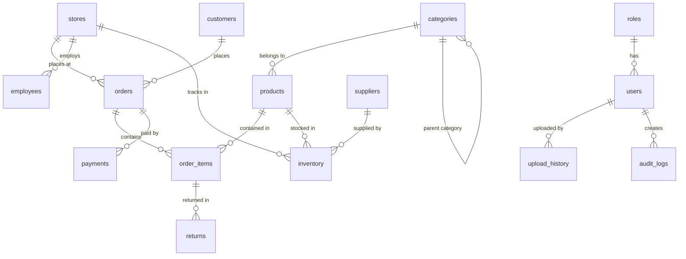

# Implementation Plan - RetailIQ (AI-Powered Retail Analytics Platform)

This document provides a comprehensive technical blueprint for the design and construction of RetailIQ, an enterprise-grade Business Intelligence and Retail Analytics Platform. It is designed to satisfy the academic requirements of an MCA Semester 3 Minor Project and serve as a showcase for senior data engineering and full-stack positions.

## User Review Required

We recommend implementing the frontend using **React + Vite (TypeScript + Tailwind CSS)** instead of Next.js because Vite is lightweight, provides instant hot-reloading for local dashboards, and allows simple packaging where the static frontend build can be served directly by FastAPI. This eliminates the need to manage a separate Node.js server in production.

> [!IMPORTANT]
> - **PostgreSQL Configuration**: The local system has a running PostgreSQL instance on port `5432` (`postgresql-x64-18`). We will target this instance using the default credentials (`postgres:postgres` or similar, configurable via `.env`).
> - **Forecasting & ML Engine**: We will implement a robust time-series forecasting pipeline using `statsmodels` (Triple Exponential Smoothing / Holt-Winters) and `scikit-learn` (RandomForest / GradientBoosting regressor for residuals). This approach is highly performant and avoids Windows-specific installation complexities associated with Prophet.
> - **RAG & GenAI Insights**: The Natural Language Executive Briefings will generate automatic, rule-based data summaries by default. It will also support optional integration with Google Gemini or OpenAI APIs via `.env` API keys.

---

## Proposed Folder Structure

We will structure the repository as follows:

```
/
├── backend/
│   ├── app/
│   │   ├── core/           # Config, database setup, security
│   │   ├── models/         # SQLAlchemy schemas
│   │   ├── schemas/        # Pydantic validation schemas
│   │   ├── api/            # API endpoints (auth, upload, analytics, reports)
│   │   ├── services/       # Business logic (cleaning, analytics, ML, reports)
│   │   └── main.py         # Entry point
│   ├── tests/              # PyTest test suite
│   ├── requirements.txt    # Python dependencies
│   └── .env.example
├── frontend/
│   ├── src/
│   │   ├── components/     # UI elements (charts, tables, forms, skeletons)
│   │   ├── pages/          # Dashboard, upload page, settings, reports
│   │   ├── hooks/          # React Query API wrappers
│   │   ├── utils/          # Formatting and helpers
│   │   ├── App.tsx
│   │   └── main.tsx
│   ├── tailwind.config.js
│   ├── package.json
│   └── vite.config.ts
├── docker-compose.yml      # Deployment orchestration
└── README.md               # Setup and guides
```

---

## Proposed Database Schema

We will implement the fully normalized schema to 3NF standards in PostgreSQL using SQLAlchemy:



### Table Definitions
1. **roles**: Role-based access controls (`role_id`, `role_name`, `description`).
2. **users**: Platform users (`user_id`, `email`, `password_hash`, `first_name`, `last_name`, `role_id`, `is_active`).
3. **stores**: Retail stores (`store_id`, `store_code`, `store_name`, `region`, `city`, `state`).
4. **categories**: Product groupings (`category_id`, `category_name`, `parent_category_id`).
5. **products**: Catalog items (`product_id`, `sku`, `product_name`, `category_id`, `cost_price`, `retail_price`).
6. **customers**: Registered buyers (`customer_id`, `customer_code`, `first_name`, `last_name`, `email`, `segment`, `registration_date`).
7. **orders**: Transaction records (`order_id`, `order_number`, `customer_id`, `store_id`, `order_date`, `total_amount`).
8. **order_items**: Line items (`order_item_id`, `order_id`, `product_id`, `quantity`, `unit_price`, `net_amount`).
9. **inventory**: Stock levels (`inventory_id`, `product_id`, `store_id`, `quantity_on_hand`, `safety_stock`, `reorder_point`, `supplier_id`).
10. **suppliers**: Third-party suppliers (`supplier_id`, `supplier_name`, `contact_name`, `email`, `phone`).
11. **employees**: Store staff (`employee_id`, `first_name`, `last_name`, `store_id`, `email`, `role`, `salary`).
12. **payments**: Checkout receipts (`payment_id`, `order_id`, `payment_date`, `payment_method`, `amount`, `status`).
13. **returns**: Customer returns (`return_id`, `order_item_id`, `return_date`, `quantity`, `refund_amount`, `reason`).
14. **upload_history**: CSV/Excel uploads log (`upload_id`, `filename`, `uploaded_by`, `status`, `records_processed`, `error_log`).
15. **audit_logs**: Application action tracking (`log_id`, `user_id`, `action`, `table_name`, `record_id`, `timestamp`).

---

## Proposed Backend Components

### 1. Ingestion & Automated Cleaning Engine
- **Multipart Upload**: `POST /api/v1/datasets/ingest` supporting `.csv` and `.xlsx` files.
- **Validation**: Schema mapping, checks for negative pricing or missing key headers.
- **Automated Cleaning**:
  - Missing numerical values filled using *median interpolation*.
  - Missing categorical elements filled using *mode substitution*.
  - Outliers flagged/scaled via *Interquartile Range (IQR)* limits.
  - Invalid currency symbols or dates parsed and converted.
- **Output**: Generates a detailed clean-up report returned to the frontend.

### 2. High-Performance OLAP Query Layer
- We will leverage **DuckDB** to execute sub-second analytical queries. When analytics are requested, Python will load transactions from PostgreSQL (or from cached parquet datasets) directly into a DuckDB in-memory database to generate summaries.
- Calculates core KPIs (Gross Revenue, Net Profit, Gross Margin %, Average Order Value, Customer Retention, and Stock Out Rates).

### 3. Machine Learning Core
- **Sales & Demand Forecast**: 30/60/90-day time-series forecasting. We will train a Holt-Winters model for seasonal trends and use Scikit-Learn to fit residual patterns.
- **Customer Segmentation**: RFM (Recency, Frequency, Monetary) clustering using K-Means.
- **AI Business Insights**: Generating human-readable performance explanations utilizing formatted statistics.

### 4. Reporting Service
- **PDF Compilation**: ReportLab to export dynamic dashboards containing formatted metrics and structured tables.
- **Excel Export**: OpenPyXL exporter writing multi-tab structured sales, product, and inventory reports.

---

## Proposed Frontend Pages & Design System

The frontend will use a sleek, modern **Dark/Glassmorphism Theme** with HSL colors, responsive layouts, and interactive Plotly charts.

### Main Pages
1. **Authentication**: Sleek, animated login, signup, and forgot password.
2. **Executive Dashboard**: High-level KPIs, MoM growth lines, category revenue splits, and AI Insight cards.
3. **Data Upload & Clean**: Drag-and-drop file uploader with validation status, clean-up adjustments, and execution history.
4. **Detailed Analytics**: Tabbed analysis sheets for Sales, Products, Customers, Inventory, and Stores.
5. **Machine Learning Hub**: Forecasting control panel (with custom slider parameters) and Customer K-Means RFM scatter plot.
6. **Reports & Exports**: Quick-action buttons to download PDF/Excel files.
7. **Settings**: Theme switcher, profile configuration, and database connection settings.

---

## Verification Plan

### Automated Tests
- We will write a suite of tests under `backend/tests/`:
  - Unit tests for cleaning algorithms (median/mode interpolation, IQR outlier removal).
  - Integration tests for FastAPI endpoints (authentication flows, upload schema validation).
  - SQL schema validation.
- Commands to run:
  ```bash
  cd backend
  pytest
  ```

### Manual Verification
1. Log in as an Administrator, upload a messy CSV dataset, verify data cleaning reports, and confirm insertion into PostgreSQL.
2. Check that the Dashboard and Analytics pages successfully compile DuckDB queries with sub-second latency.
3. Verify that the ML Forecasting and Customer Segments display mathematical groupings correctly.
4. Download the generated PDF and Excel reports to check layout consistency and data accuracy.
